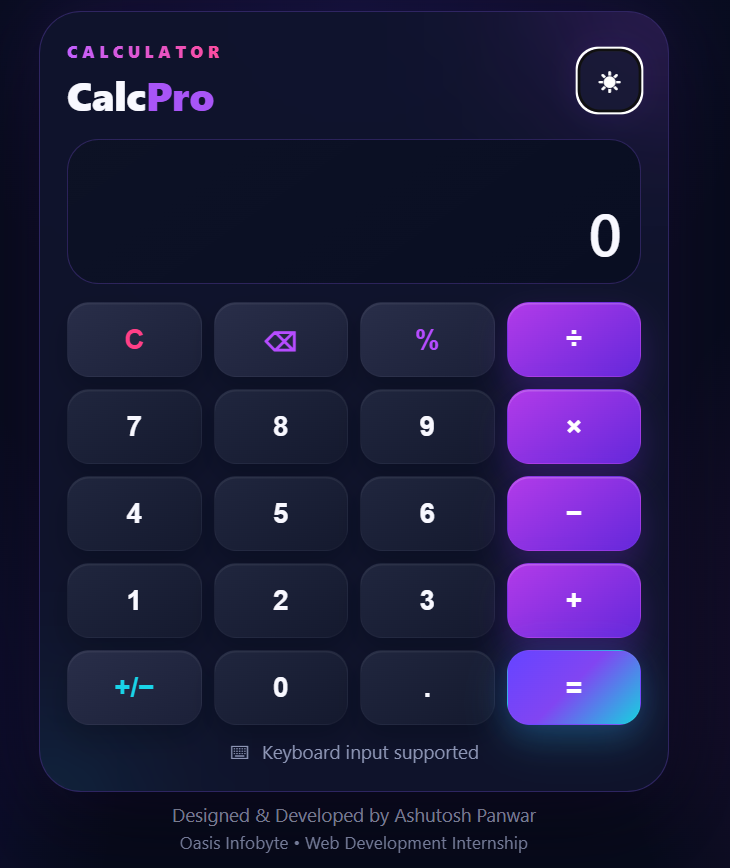
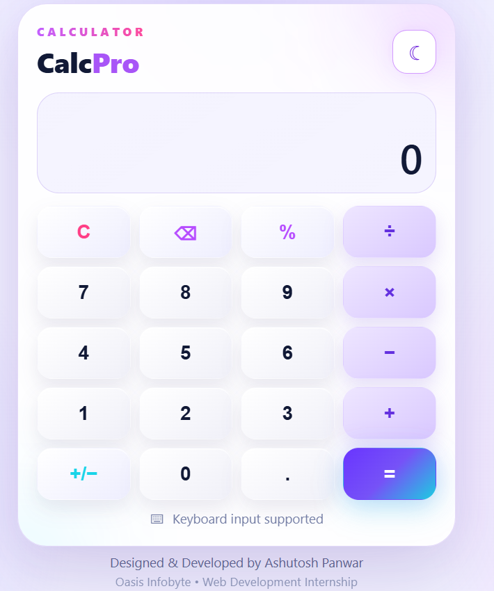
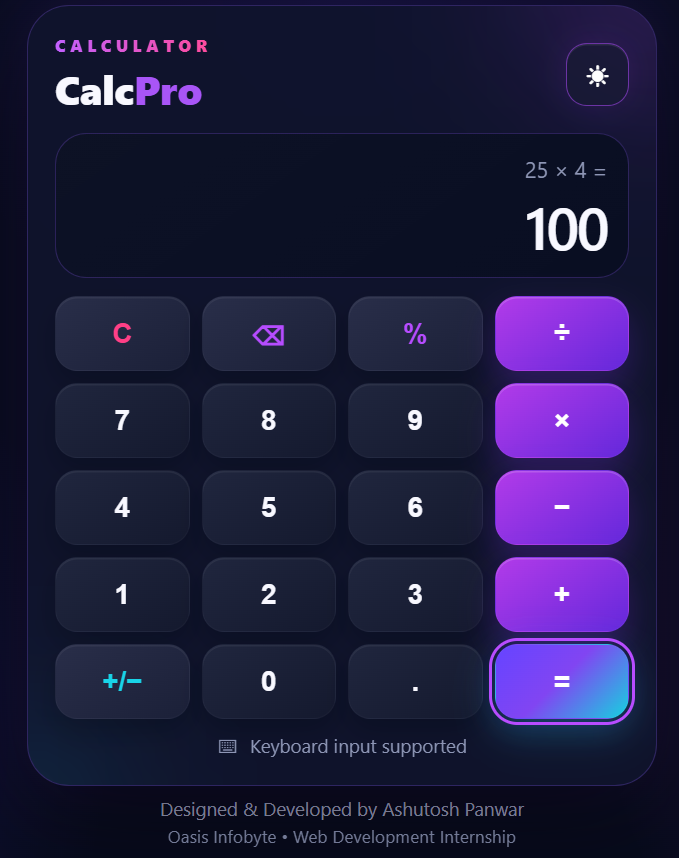

# CalcPro – Modern Web Calculator

CalcPro is a modern, responsive, browser-based calculator developed as part of the **Oasis Infobyte Web Development and Designing Internship – Level 2, Task 1**.

The application performs basic arithmetic operations through a clean and user-friendly interface. It is built entirely using **HTML5, CSS3, and Vanilla JavaScript**.

## 🌐 Live Demo

[View CalcPro Live](https://ashutosh9-pan.github.io/OIBSIP/WebDev-L2-Calculator/)

## ✨ Features

- Basic arithmetic operations:
  - Addition (+)
  - Subtraction (−)
  - Multiplication (×)
  - Division (÷)
- Numeric buttons from 0–9
- Decimal number support
- Clear (C) functionality
- Backspace/Delete functionality
- Percentage (%) calculation
- Positive/Negative (+/−) toggle
- Division-by-zero error handling
- Sequential operator chaining
- Keyboard input support
- Dark and Light theme toggle
- Theme preference saved using Local Storage
- Responsive design for desktop and mobile devices
- CSS Grid based calculator layout
- JavaScript event listeners for button interactions
- No `eval()` used

## 🛠️ Tech Stack

- HTML5
- CSS3
- JavaScript (Vanilla)

No external JavaScript frameworks or libraries are used.

## 📸 Screenshots

### Dark Theme



### Light Theme



### Calculation Result



## ⌨️ Keyboard Controls

| Key | Action |
| --- | --- |
| `0-9` | Enter numbers |
| `+` | Addition |
| `-` | Subtraction |
| `*` | Multiplication |
| `/` | Division |
| `.` | Decimal point |
| `%` | Percentage |
| `Enter` or `=` | Calculate result |
| `Backspace` | Delete last digit |
| `Esc` | Clear calculator |

## 📁 Project Structure

```text
WebDev-L2-Calculator/
│
├── screenshots/
│   ├── calculator-dark.png
│   ├── calculator-light.png
│   └── calculator-result.png
│
├── index.html
├── style.css
├── script.js
└── README.md
```

## 🚀 How to Run

1. Download or clone the repository.
2. Open the `WebDev-L2-Calculator` folder.
3. Open `index.html` in a web browser.

Alternatively, open the project in Visual Studio Code and run `index.html` using the Live Server extension.

## 🎯 Internship Task

**Organization:** Oasis Infobyte  
**Track:** Web Development and Designing  
**Level:** Level 2  
**Task:** Task 1 – Calculator

### Objective

Build a fully functional browser-based calculator capable of performing basic arithmetic operations with a user-friendly button interface.

## 👨‍💻 Developer

**Ashutosh Panwar**

Developed as part of the **Oasis Infobyte Web Development and Designing Internship**.