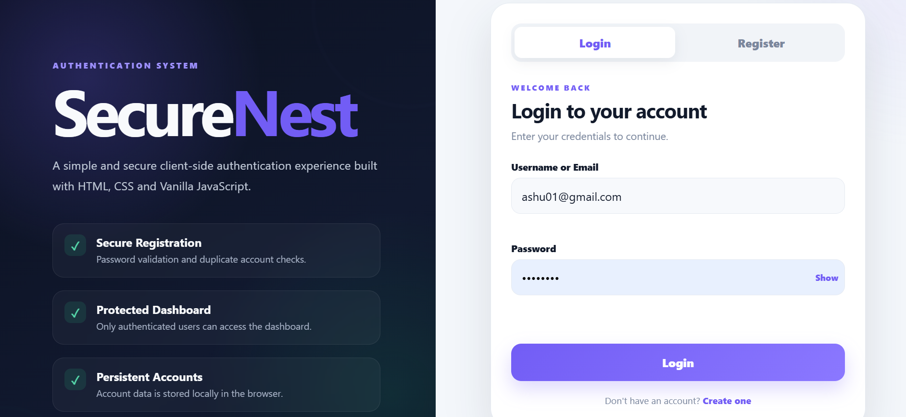
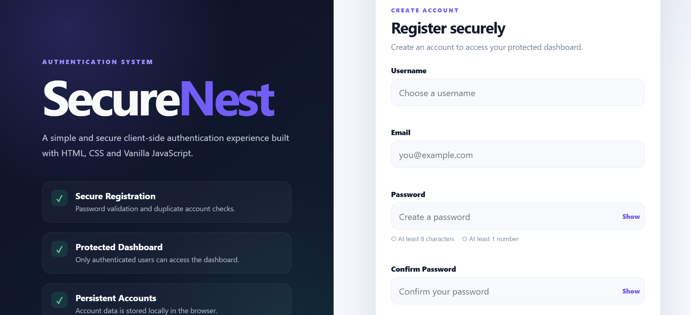
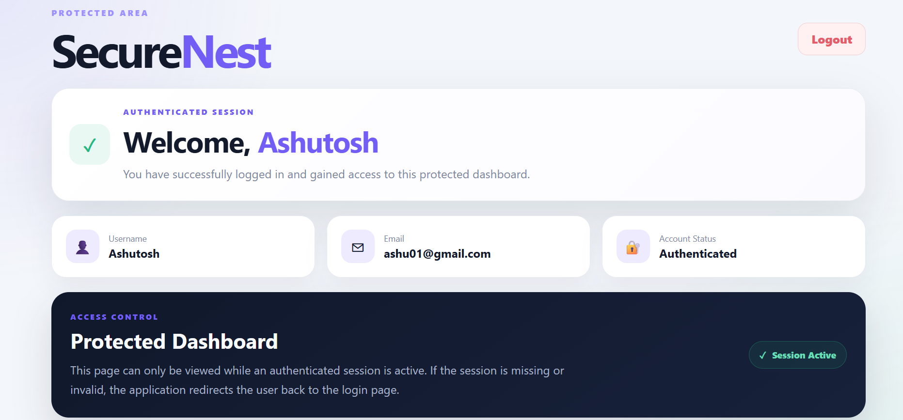
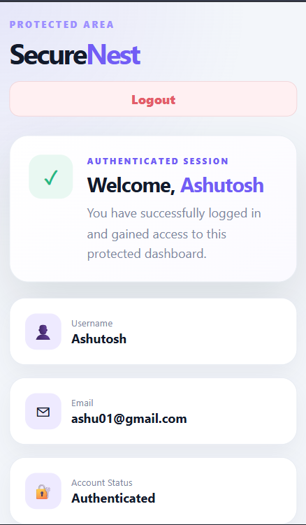

# 🔐 SecureNest – Login Authentication System

SecureNest is a responsive client-side authentication system developed as part of the **Oasis Infobyte Web Development & Designing Internship**.

The application provides user registration, login validation, persistent account storage, and access to a protected dashboard using **HTML5, CSS3, Vanilla JavaScript, and localStorage**.

## ✨ Features

- User registration with username, email, and password
- Password validation
  - Minimum 8 characters
  - At least 1 number
- Confirm password validation
- Duplicate username and email detection
- Login using username or email
- Secure-style generic error handling for incorrect credentials
- Show/Hide password functionality
- Protected dashboard access
- Authentication session validation
- Automatic redirect for unauthenticated users
- Logout functionality
- Persistent account storage using `localStorage`
- Responsive design for desktop and mobile devices

## 🛠️ Tech Stack

- **HTML5** – Application structure
- **CSS3** – Styling and responsive layout
- **JavaScript (Vanilla JS)** – Authentication logic and DOM manipulation
- **localStorage** – Persistent user account storage
- **sessionStorage** – Active login session management

## 📸 Screenshots

### Login Page



### Registration Page



### Protected Dashboard



### Mobile Responsive Design



## 🔑 Authentication Flow

1. A new user creates an account from the registration page.
2. The application validates the entered information.
3. Duplicate usernames and email addresses are rejected.
4. Registered account information is stored locally in the browser.
5. The user can log in using their username or email and password.
6. After successful authentication, the user is redirected to the protected dashboard.
7. Direct dashboard access without an active session redirects the user to the login page.
8. Logout clears the active session and returns the user to the login screen.

## 📂 Project Structure

```text
WebDev-L2-LoginAuthentication/
│
├── index.html
├── dashboard.html
├── style.css
├── script.js
├── README.md
│
└── screenshots/
    ├── 01-login-page.png
    ├── 02-register-page.png
    ├── 03-dashboard.png
    └── 04-mobile-responsive.png
```

## 🚀 How to Run

1. Clone or download the repository.
2. Open the `WebDev-L2-LoginAuthentication` folder.
3. Open `index.html` in a web browser.

For development, the project can also be launched using the **Live Server** extension in Visual Studio Code.

## 📱 Responsive Design

SecureNest is designed to work across different screen sizes. The layout automatically adapts for desktop and mobile devices while maintaining access to all authentication features.

## ⚠️ Important Note

This project demonstrates **client-side authentication for educational purposes**. Since account information is stored in browser storage, it should not be considered a production authentication solution.

Real-world applications should use secure server-side authentication, hashed passwords, HTTPS, secure sessions, and a protected database.

## 🎯 Internship Task

**Oasis Infobyte – Web Development & Designing Internship**

- **Level:** 2
- **Task:** 4
- **Project:** Login Authentication System

## 👨‍💻 Developer

**Ashutosh Panwar**

Developed as part of the **Oasis Infobyte Web Development & Designing Internship**.