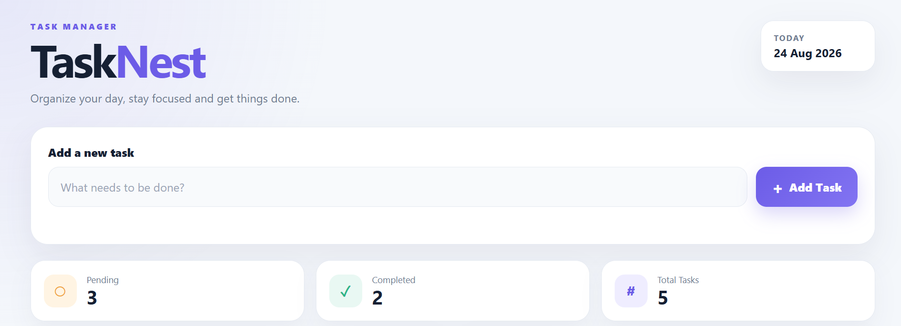
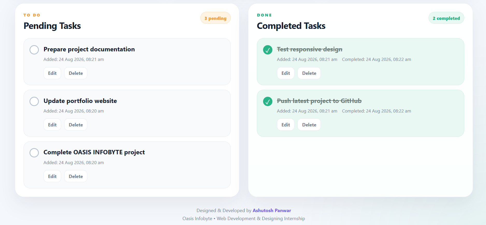
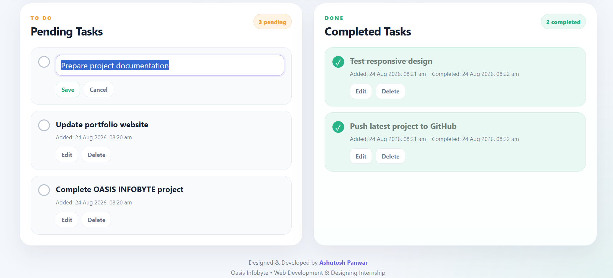
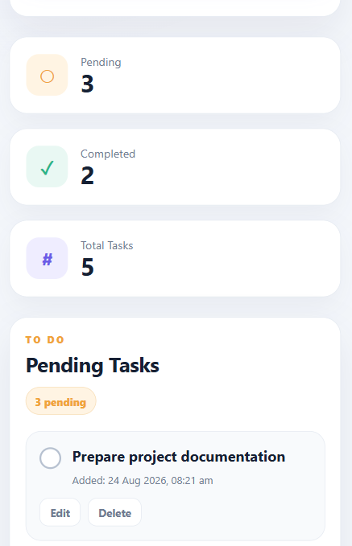

# ✅ TaskNest — To-Do Web App

TaskNest is a clean, responsive, and interactive To-Do Web Application developed as part of the **OASIS INFOBYTE Web Development & Designing Internship**.

The application helps users organize daily tasks by allowing them to add, edit, complete, and delete tasks while automatically separating pending and completed items.

## ✨ Features

- ➕ Add new tasks
- ⏳ Separate Pending Tasks section
- ✅ Mark tasks as completed
- 📝 Edit tasks inline
- 🗑️ Delete tasks
- 🔢 Real-time Pending, Completed, and Total task counters
- 🕒 Task creation timestamps
- ✔️ Completion timestamps
- 💾 Tasks persist after page refresh using Local Storage
- 📭 Friendly empty-state messages
- 📱 Fully responsive design for desktop and mobile
- 🎨 Clean and modern user interface

## 🛠️ Tech Stack

- HTML5
- CSS3
- JavaScript
- DOM Manipulation
- Browser Local Storage

## 📸 Screenshots

### Dashboard



### Pending & Completed Tasks



### Inline Task Editing



### Mobile Responsive Design



## 🚀 How to Run Locally

1. Clone this repository:

```bash
git clone https://github.com/Ashutosh9-pan/OIBSIP.git
```

2. Open the project directory:

```bash
cd OIBSIP/WebDev-L2-ToDoApp
```

3. Open `index.html` in your browser.

You can also use the **Live Server** extension in Visual Studio Code.

## 📂 Project Structure

```text
WebDev-L2-ToDoApp/
│
├── screenshots/
│   ├── 01-dashboard.png
│   ├── 02-task-lists.png
│   ├── 03-edit-task.png
│   └── 04-mobile-responsive.png
│
├── index.html
├── style.css
├── script.js
└── README.md
```

## 💡 Key Functionality

TaskNest uses JavaScript DOM manipulation to dynamically render and update tasks without reloading the page.

Task information is stored in the browser using `localStorage`, allowing tasks to remain available even after refreshing or reopening the page.

Each task keeps track of its creation time and completed tasks also display their completion time.

## 📱 Responsive Design

The interface automatically adapts to different screen sizes.

On desktop devices, pending and completed tasks are displayed in a spacious two-column layout, while smaller screens use a mobile-friendly stacked layout.

## 🎓 Internship Project

This project was developed as part of the:

**OASIS INFOBYTE — Web Development & Designing Internship**

**Task:** Level 2 — Task 3  
**Project:** To-Do Web App

## 👨‍💻 Developer

**Ashutosh Panwar**

GitHub: `Ashutosh9-pan`

---

⭐ If you found this project useful, consider giving the repository a star.