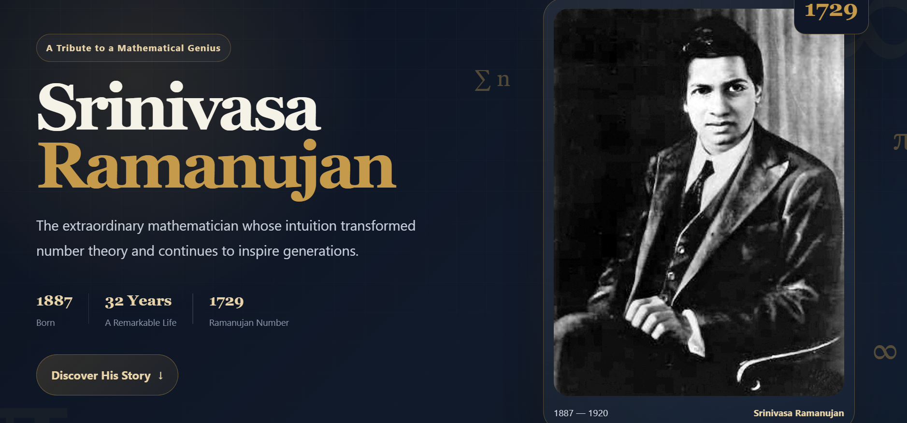
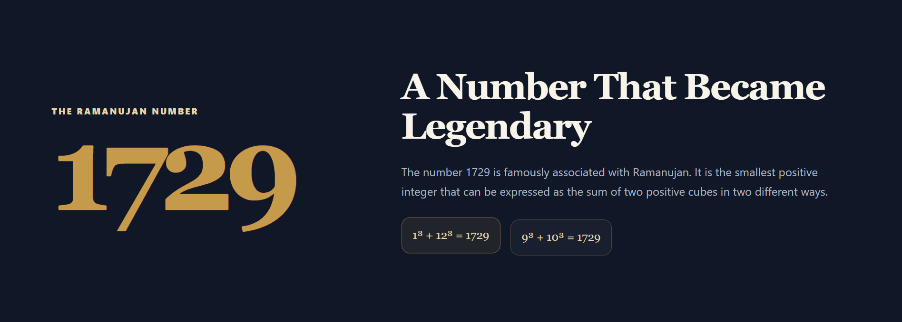
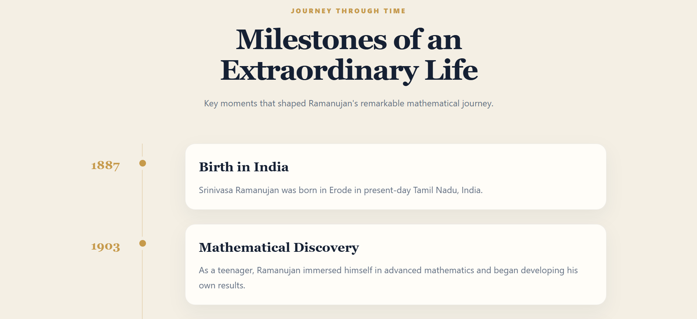
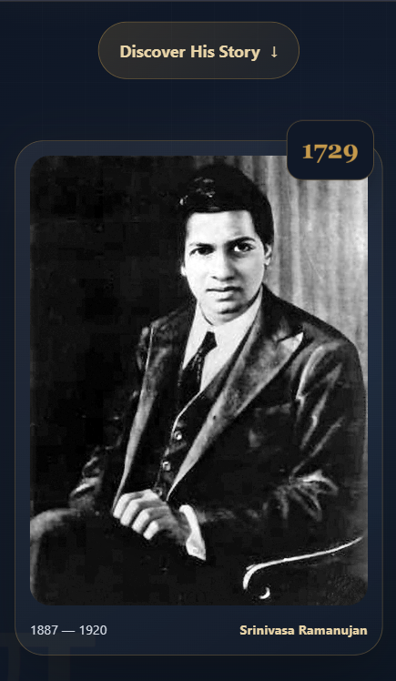

# Srinivasa Ramanujan Tribute Page

A visually engaging and responsive tribute page dedicated to **Srinivasa Ramanujan**, one of the most extraordinary mathematicians in history.

This project was developed as part of the **Oasis Infobyte Web Development & Designing Internship – Level 2, Task 2** using only **HTML5 and CSS3**.

## ✨ Features

- Premium mathematics-inspired tribute page design
- Hero section with:
  - Srinivasa Ramanujan's name
  - One-line tribute tagline
  - Historical portrait
  - Birth year and lifespan
  - Famous Ramanujan number `1729`
- Detailed biography and tribute section
- Dedicated section explaining the significance of 1729
- Mathematical equation cards
- Timeline of major life events and achievements
- Styled quotation section
- Legacy and inspiration section
- Multiple background colours across sections
- Serif and sans-serif typography combination
- Responsive layout for desktop, tablet, and mobile devices
- Smooth scrolling
- CSS-only entrance and hover animations
- Public-domain image with proper source attribution

## 🛠️ Tech Stack

- HTML5
- CSS3

JavaScript is not required for this project.

## 📸 Screenshots

### Hero Section



### Ramanujan Number – 1729



### Life Timeline



### Mobile Responsive View



## 🔢 The Ramanujan Number

The number **1729** is famously associated with Srinivasa Ramanujan.

It is the smallest positive integer that can be expressed as the sum of two positive cubes in two different ways:

```text
1³ + 12³ = 1729
9³ + 10³ = 1729
```

## 📁 Project Structure

```text
WebDev-L2-TributePage/
│
├── images/
│   └── ramanujan.jpg
│
├── screenshots/
│   ├── 01-hero.png
│   ├── 02-ramanujan-number.png
│   ├── 03-timeline.png
│   └── 04-mobile-responsive.png
│
├── index.html
├── style.css
└── README.md
```

## 🚀 How to Run

1. Download or clone the repository.
2. Open the `WebDev-L2-TributePage` folder.
3. Open `index.html` in any modern web browser.

You can also open the project in Visual Studio Code and run `index.html` using the Live Server extension.

## 🎯 Internship Task

**Organization:** Oasis Infobyte  
**Track:** Web Development & Designing  
**Level:** Level 2  
**Task:** Task 2 – Tribute Page

### Objective

Design and build a visually engaging tribute page dedicated to a historical figure, scientist, artist, or public figure.

## 🖼️ Image Credit

Portrait of Srinivasa Ramanujan:

**Oberwolfach Photo Collection**  
Public Domain, via Wikimedia Commons.

## 👨‍💻 Developer

**Ashutosh Panwar**

Developed as part of the **Oasis Infobyte Web Development & Designing Internship**.